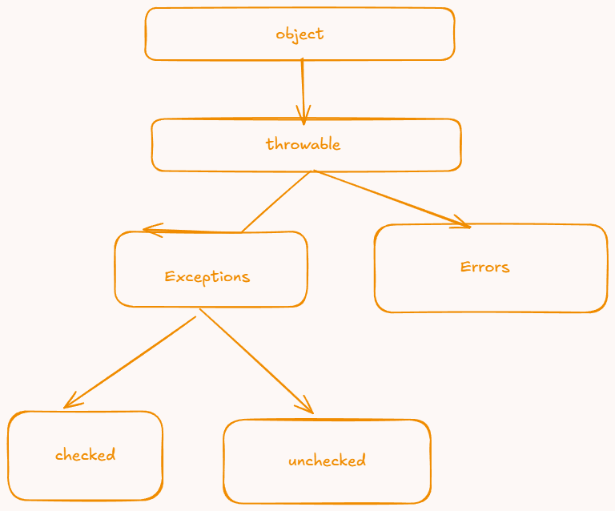

exception -  error is non recoverable 
- something which prevents normal flow of the program
- throwable class is handles all the exceptions and errors


- Checked - checked exceptions are checks during compile time 
- Unchecked Exception - something that compiler wont able to detect




Alright, we’ll do this like a real developer learns — not with memorized theory, but with clarity of *why* these features exist and how they make your code bulletproof.

Let’s start with **Exception Handling**, then we’ll move to **Generics** (both are pillars of writing safe, professional Java code).

---

## ⚡ PART 1: Exception Handling

### 1️⃣ Why exceptions exist

When your program crashes because of a divide-by-zero, null access, or file not found — that’s an *exceptional* situation.
Java doesn’t want your program to die silently, so it throws **Exception objects** to signal these problems.

Without handling them, the JVM kills the program.
With proper handling, you can *catch* and *recover* safely.

---

### 2️⃣ Basic structure

```java
try {
    // risky code
    int a = 10 / 0;
} catch (ArithmeticException e) {
    System.out.println("Cannot divide by zero: " + e.getMessage());
} finally {
    System.out.println("Always executes, even if error occurs");
}
```

**Flow:**

* `try` → Code that *might* throw an exception.
* `catch` → Handles specific exceptions.
* `finally` → Always runs (closing files, releasing resources, etc).

---

### 3️⃣ Common built-in exceptions

| Type                             | Example Cause                |
| -------------------------------- | ---------------------------- |
| `ArithmeticException`            | Division by zero             |
| `NullPointerException`           | Using null reference         |
| `ArrayIndexOutOfBoundsException` | Accessing array beyond limit |
| `NumberFormatException`          | Parsing non-number string    |
| `FileNotFoundException`          | Missing file while reading   |

---

### 4️⃣ Checked vs Unchecked exceptions

| Type          | Examples                                  | Must Handle?            |
| ------------- | ----------------------------------------- | ----------------------- |
| **Checked**   | IOException, SQLException                 | ✅ Yes (compiler checks) |
| **Unchecked** | NullPointerException, ArithmeticException | ❌ No (runtime only)     |

Checked = compile-time warning → you must use try-catch or throws.
Unchecked = runtime crash if ignored.

---

### 5️⃣ Custom Exception Example

Sometimes Java’s built-in exceptions aren’t enough. You can make your own.

```java
class InvalidAgeException extends Exception {
    public InvalidAgeException(String msg) {
        super(msg);
    }
}

public class Test {
    static void validateAge(int age) throws InvalidAgeException {
        if (age < 18) {
            throw new InvalidAgeException("Not eligible to vote");
        }
        System.out.println("Valid age");
    }

    public static void main(String[] args) {
        try {
            validateAge(15);
        } catch (InvalidAgeException e) {
            System.out.println("Caught: " + e.getMessage());
        }
    }
}
```

---

### 6️⃣ Key rules to remember

* You can have multiple `catch` blocks.
* You can catch parent exception types (`Exception`, `Throwable`) for generic handling.
* `finally` always runs — even if exception is thrown or `return` happens.
* Never leave empty catch blocks — that hides bugs.
* Use `throw` to manually raise exceptions.
* Use `throws` to declare a method might throw one.

---

**Simple way to think:**

> Try = risky zone
> Catch = safety net
> Finally = cleanup crew
> Throw = trigger alarm
> Throws = warning sign

---
 