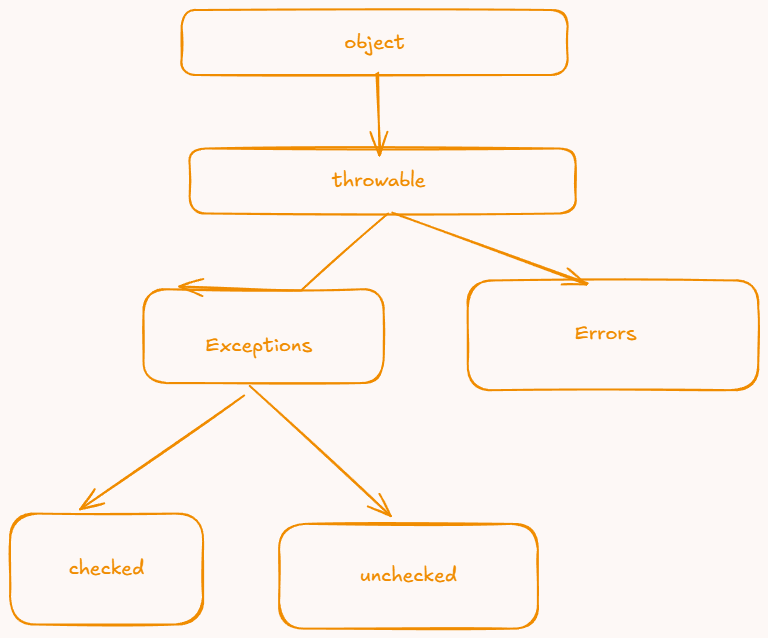

exception -  error is non recoverable 
- something which prevents normal flow of the program
- throwable class is handles all the exceptions and errors


- Checked - checked exceptions are checks during compile time 
- Unchecked Exception - something that compiler wont able to detect



 
---

## ⚡ PART 1: Exception Handling

### 1️⃣ Why exceptions exist

When your program crashes because of a divide-by-zero, null access, or file not found — that’s an *exceptional* situation.
Java doesn’t want your program to die silently, so it throws **Exception objects** to signal these problems.

Without handling them, the JVM kills the program.
With proper handling, you can *catch* and *recover* safely.

---

### 2️⃣ Basic structure

```java
try {
    // risky code
    int a = 10 / 0;
} catch (ArithmeticException e) {
    System.out.println("Cannot divide by zero: " + e.getMessage());
} finally {
    System.out.println("Always executes, even if error occurs");
}
```

**Flow:**

* `try` → Code that *might* throw an exception.
* `catch` → Handles specific exceptions.
* `finally` → Always runs (closing files, releasing resources, etc).

---

### 3️⃣ Common built-in exceptions

| Type                             | Example Cause                |
| -------------------------------- | ---------------------------- |
| `ArithmeticException`            | Division by zero             |
| `NullPointerException`           | Using null reference         |
| `ArrayIndexOutOfBoundsException` | Accessing array beyond limit |
| `NumberFormatException`          | Parsing non-number string    |
| `FileNotFoundException`          | Missing file while reading   |

---

### 4️⃣ Checked vs Unchecked exceptions

| Type          | Examples                                  | Must Handle?            |
| ------------- | ----------------------------------------- | ----------------------- |
| **Checked**   | IOException, SQLException                 | ✅ Yes (compiler checks) |
| **Unchecked** | NullPointerException, ArithmeticException | ❌ No (runtime only)     |

Checked = compile-time warning → you must use try-catch or throws.
Unchecked = runtime crash if ignored.

---

### 5️⃣ Custom Exception Example

Sometimes Java’s built-in exceptions aren’t enough. You can make your own.

```java
class InvalidAgeException extends Exception {
    public InvalidAgeException(String msg) {
        super(msg);
    }
}

public class Test {
    static void validateAge(int age) throws InvalidAgeException {
        if (age < 18) {
            throw new InvalidAgeException("Not eligible to vote");
        }
        System.out.println("Valid age");
    }

    public static void main(String[] args) {
        try {
            validateAge(15);
        } catch (InvalidAgeException e) {
            System.out.println("Caught: " + e.getMessage());
        }
    }
}
```

---

### 6️⃣ Key rules to remember

* You can have multiple `catch` blocks.
* You can catch parent exception types (`Exception`, `Throwable`) for generic handling.
* `finally` always runs — even if exception is thrown or `return` happens.
* Never leave empty catch blocks — that hides bugs.
* Use `throw` to manually raise exceptions.
* Use `throws` to declare a method might throw one.

---

**Simple way to think:**

> Try = risky zone
> Catch = safety net
> Finally = cleanup crew
> Throw = trigger alarm
> Throws = warning sign

---
 

 Syntax:

throw new ExceptionType("Error message");


Example:

if(age < 18) {
    throw new ArithmeticException("Not eligible to vote");
}


💬 Think: “throw” = Main khud exception phenk raha hu.

🔹 throws

“Method ke signature me likhte hai to warn the compiler ke yeh method exception throw kar sakta hai.”

When to choose which:

Checked (extends Exception): for recoverable, expected conditions that callers should handle.
Unchecked (extends RuntimeException): for programming errors or when you don’t want to force callers to catch/declare.


Throwable is the root. It has two main branches: Exception and Error.
Unchecked = RuntimeException and Error (and their subclasses).
Checked = all other subclasses of Exception (i.e., Exception minus RuntimeException).
Your InvalidAgeException extends Exception, so it’s a checked exception. Callers must catch it or declare throws.
super(message) stores the message in Throwable. getMessage() reads it back.


/
Exception hierarchy (what is what)

Throwable
Error (unchecked): serious VM problems; never catch or throw yourself (e.g., OutOfMemoryError, StackOverflowError).
Exception
RuntimeException (unchecked): programming/precondition errors (e.g., NullPointerException, IllegalArgumentException).
Checked exceptions (everything under Exception except RuntimeException): recoverable conditions callers must handle (e.g., IOException, SQLException, your InvalidAgeException if it extends Exception).
Checked vs. unchecked rules

Checked (extends Exception but not RuntimeException):
Must be caught or declared with throws.
Compiler enforces this.
Unchecked (RuntimeException and Error and their subclasses):
No need to catch or declare; you still may catch them.
Use for programming errors or API misuse.
Never extend Error.
Designing custom exceptions

Extend Exception for expected, recoverable, domain errors that callers should handle.
Extend RuntimeException for precondition violations or misuse (callers aren’t forced to handle).
Provide at least:
Constructors: (String message), (String message, Throwable cause), optionally (Throwable cause).
Good, actionable messages.
Catching and ordering

Catch the most specific first, then broader (InvalidAgeException before Exception).
Avoid catch (Exception) except at app boundaries (e.g., main, thread pool) where you log and recover.
Do not catch Throwable or Error.
throws, overriding, and propagation

Methods that may throw checked exceptions must declare them with throws.
Unchecked exceptions can be thrown without declaring; declaring them is optional (documentation only).
Overriding:
Cannot add new/broader checked exceptions than the superclass method declares.
May remove or narrow checked exceptions.
May add unchecked exceptions.
Uncaught exceptions propagate up the stack; default handler prints stack trace and ends the thread.
try/finally and try-with-resources

finally always runs (except JVM termination); use for cleanup.
Prefer try-with-resources for AutoCloseable resources; suppressed exceptions are accessible via getSuppressed().
Message handling

super(message) stores it in Throwable; retrieved via getMessage().